[[TOC]]

[[TOF]]

# 1. Qué hace EasyOCR y qué necesita

EasyOCR lee las facturas de proveedor y los tickets de gasto que llegan en PDF o
en foto, saca de ellos el proveedor, el número, la fecha y los importes, y con
esos datos prepara la factura de proveedor en Odoo.

Funciona con documentos de dos clases:

- **PDF que ya llevan texto** (los que le envía un proveedor por correo
  electrónico). Estos se leen siempre, sin coste y sin conexión a nada.
- **Escaneos y fotos** de papel, que son una imagen y no llevan texto dentro.
  Para leer estos hace falta el servicio de EasyOCR.

## Lo que necesita para funcionar

El módulo se instala y funciona solo. Puede usarlo para leer PDF con texto
desde el primer día, gratis y sin configurar nada.

Lo que **no** puede hacer por sí solo es leer un escaneo o una foto: eso lo
resuelve el servicio de extracción de EasyOCR, y **hasta que no lo configure,
los escaneos y las fotos no se leerán**. Si pulsa «Leer con IA» sin haberlo
configurado, el módulo se lo dirá con este aviso, sin más consecuencias:

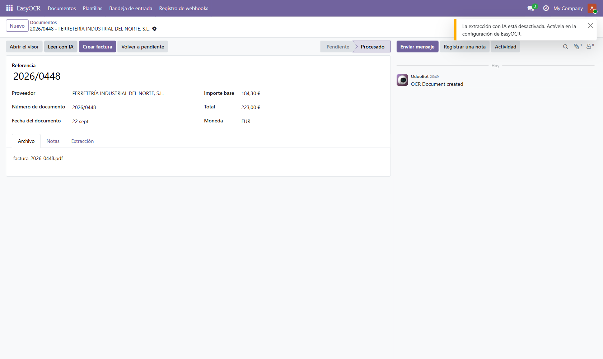

Cuando eso ocurre no se pierde nada: el documento se queda donde estaba, con el
archivo adjunto intacto, y puede leerlo a mano o volver a intentarlo más tarde.

## Lo que cuesta

El módulo es **software libre**, con la misma licencia que el propio Odoo. No
hay nada que pagar por él y el código fuente completo va con cada versión.

Lo que se contrata aparte es **el servicio de lectura**. Si trabaja solo con PDF
que ya traen texto, no necesita contratar nada.

# 2. Instalación

El módulo se llama **EasyOCR** y se instala como cualquier otra aplicación de
Odoo: entre en **Aplicaciones**, borre el filtro «Aplicaciones» y busque
«EasyOCR».

Sobre la ficha verá el botón para instalarla. Si ya está instalada, la ficha se
limita a ofrecerle más información, como en la imagen.

Al terminar la instalación aparece una aplicación nueva llamada **EasyOCR** en
el menú principal, con cuatro entradas:

- **Documentos** — los documentos leídos y por leer.
- **Plantillas** — las casillas guardadas de cada proveedor.
- **Bandeja de entrada** — los archivos que le han entregado otros módulos.
- **Registro de webhooks** — las llamadas recibidas desde el servicio.

Los permisos van en dos niveles: **Usuario** (trabajar con documentos) y
**Responsable** (además, configurar y lanzar la lectura con IA). Se asignan
desde **Ajustes > Usuarios**, como cualquier otro permiso de Odoo.

# 3. Configuración

La configuración vive en **Ajustes > EasyOCR**. Son cuatro campos:

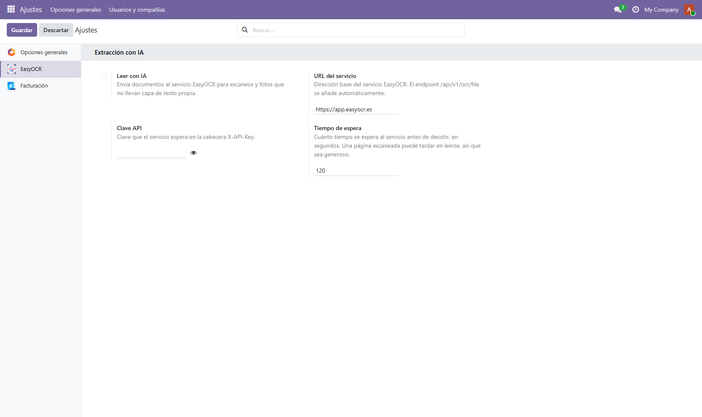

|[tabla: Opciones de configuración de EasyOCR]|
|---|---|
| **Leer con IA** | Enciende o apaga el envío de documentos al servicio. Mientras está apagado, el módulo no manda nada a ningún sitio. |
| **URL del servicio** | La dirección del servicio de EasyOCR. Se escribe sin nada más: el módulo añade por su cuenta la parte final de la dirección. |
| **Clave API** | La clave que identifica su cuenta ante el servicio. Se la da EasyOCR al contratar el servicio. |
| **Tiempo de espera** | Cuántos segundos espera Odoo la respuesta antes de darse por vencido. Una página escaneada puede tardar, así que conviene dejarlo generoso. |

Cuando termine de rellenarlo, pulse **Guardar**. El botón **Descartar** deja
todo como estaba.

**Nada de esto hace falta si solo va a leer PDF que ya traen texto.** Deje
«Leer con IA» apagado y el módulo funcionará igual.

## Un ajuste que no está en esta pantalla

Si va a recibir documentos desde el servicio por la vía automática —sin nadie
delante— hay un quinto ajuste que no tiene casilla en la pantalla: el **secreto
compartido**. Se guarda como parámetro del sistema, con el nombre
`easyocr.webhook_secret`.

Mientras ese valor no exista, la dirección que recibe los avisos del servicio
rechaza **todas** las llamadas. Es deliberado: un secreto con un valor por
defecto no es un secreto, así que el módulo prefiere quedarse cerrado antes que
abierto. Si no va a usar esta vía, no tiene que hacer nada.

# 4. Dónde viven los documentos

Todo empieza en **EasyOCR > Documentos**.

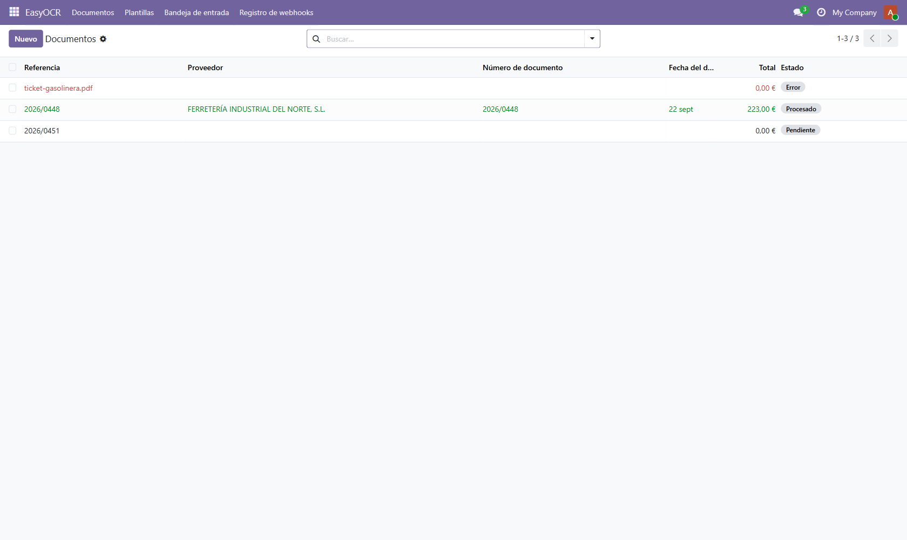

La lista tiene una columna **Estado** con tres valores posibles:

- **Pendiente** (en negro): el archivo está dentro, todavía no se ha leído.
- **Procesado** (en verde): ya se ha leído y revisado.
- **Error** (en rojo): se intentó leer y no se pudo. El motivo está en el propio
  documento, y se puede volver a intentar.

Puede buscar por referencia, proveedor o número de documento, y agrupar por
proveedor, estado o fecha desde los filtros de la barra de búsqueda.

Al abrir un documento, la ficha tiene los datos a la izquierda y los botones
arriba:

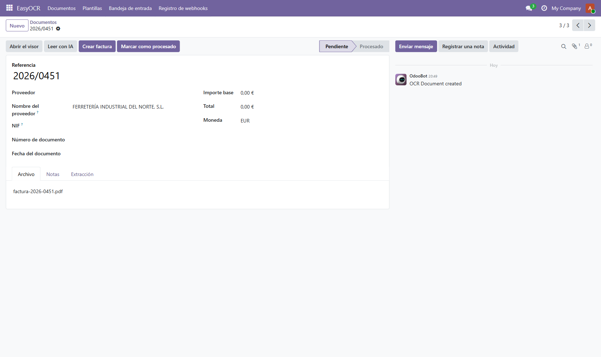

| **Abrir el visor** | Abre la pantalla grande donde se ve el documento y se dibujan las casillas. |
| **Leer con IA** | Manda el archivo al servicio. Solo aparece si hay archivo adjunto y si tiene usted el permiso de responsable. |
| **Crear factura** | Prepara la factura de proveedor con lo que hay en la ficha. |
| **Marcar como procesado** | Da el documento por revisado sin crear nada. |

Debajo, tres pestañas: **Archivo** (el PDF), **Notas** y **Extracción** (la
respuesta del servicio y su nivel de confianza, útil solo cuando hay que pedir
soporte).

# 5. El visor: dibujar de dónde se lee cada dato

El visor es la pantalla que da sentido al módulo. Se abre con **Abrir el visor**
y ocupa toda la pantalla: el documento a la izquierda, los datos a la derecha.

Arriba hay una barra con nueve botones, uno por cada dato que se puede leer. El
color de cada botón es el color con el que se pintará el recuadro en el
documento, así que siempre se sabe qué recuadro es qué.

## El paso a paso

1. Pulse el botón del dato que quiere leer. Por ejemplo, **Proveedor**.
2. Con el botón pulsado, arrastre el ratón sobre el documento para dibujar un
   recuadro alrededor de ese dato. Como el recuadro se lee del texto que hay
   debajo, puede ajustarlo a una parte de la línea si le conviene.
3. Al soltar, el texto que ha quedado dentro aparece a la derecha, en la lista
   de datos.

Repita con los datos que le interesen. Así queda un documento con cinco campos
marcados:

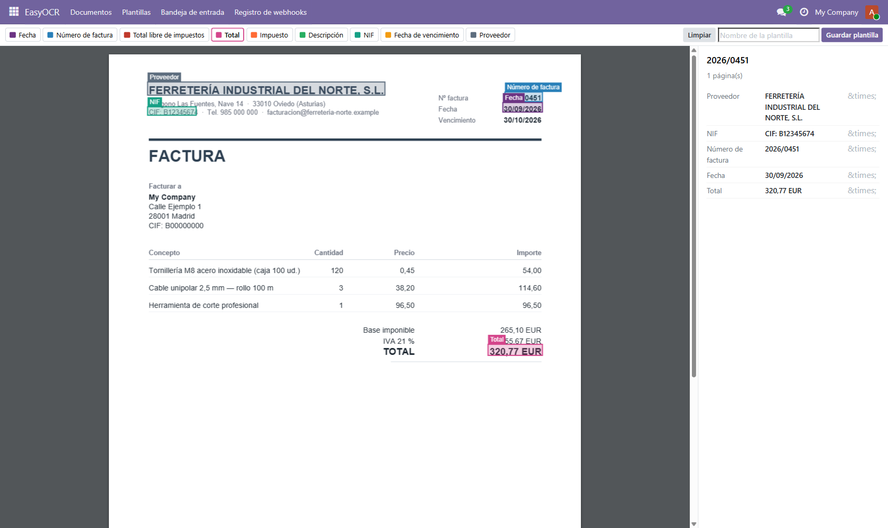

Si un recuadro no le convence, la **×** de su derecha lo quita. El botón
**Limpiar** borra todos de golpe.

Con esto ya tiene lo importante: los datos del proveedor leídos del documento,
sin teclear.

# 6. Guardar la plantilla del proveedor

Cuando los recuadros son los que quiere, póngale un nombre en la casilla
**Nombre de la plantilla** y pulse **Guardar plantilla**.

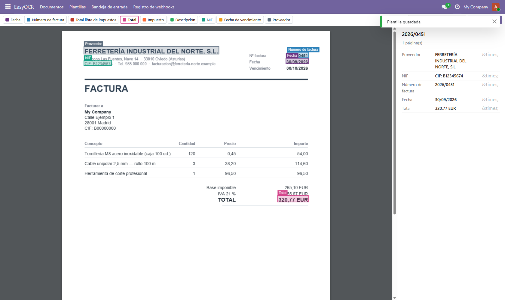

La plantilla queda guardada en **EasyOCR > Plantillas**, con las casillas y las
coordenadas exactas de cada una:

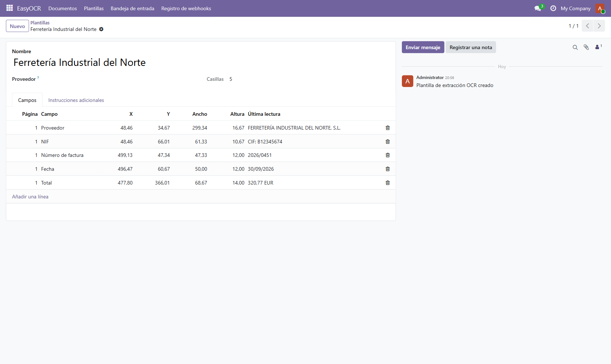

**Conviene saberlo antes de contar con ello:** en esta versión la plantilla se
guarda, pero el módulo **todavía no la aplica solo** al siguiente documento del
mismo proveedor. Es decir, hoy la plantilla sirve como registro de dónde estaba
cada dato, pero los recuadros hay que volver a dibujarlos en cada documento.
Aplicarla automáticamente está en la hoja de ruta.

# 7. Leer un documento con IA

El botón **Leer con IA** es lo que lee los escaneos y las fotos. Manda el
archivo al servicio y rellena la ficha con lo que devuelve: nombre y NIF del
proveedor, número de documento, fecha, importe base y total.

Si sale bien, verá un aviso de que el documento se ha leído y los campos
rellenos. Si sale mal, el documento **no se pierde**: se queda con el motivo
escrito, y puede corregirlo a mano o volver a intentarlo.

## Cuando falla

Los avisos que se ve son estos:

|[tabla: Motivos por los que una lectura puede fallar]|
|---|---|
| **La extracción con IA está desactivada** | No está encendida la opción en Ajustes. Actívela y vuelva a intentarlo. |
| **El servicio no se ha podido alcanzar** | La dirección no es correcta o no hay conexión. Revise la URL del servicio. |
| **El servicio ha rechazado la clave API** | La clave no es válida o es de otra cuenta. |
| **El servicio está caído u ocupado** | Es temporal. Vuelva a intentarlo dentro de un rato. |
| **No se ha podido emparejar ningún proveedor** | La lectura fue bien, pero el NIF del documento no está en ningún contacto. Cree el proveedor o indíquelo a mano en la ficha. |

Un aviso que **no** es un error: cuando el servicio solo puede leer el documento
en parte, lo dice y añade si merece la pena volver a intentarlo. En ese caso los
datos que sí ha leído quedan puestos, y el resto se completa a mano.

# 8. Crear la factura de proveedor

Con la ficha rellena —por la lectura con IA o a mano— el paso final es **Crear
factura**.

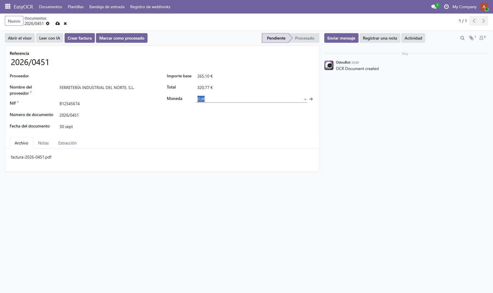

El módulo busca el proveedor por su NIF y, si no lo encuentra, por el nombre.
Después prepara un borrador de factura de proveedor con esos datos:

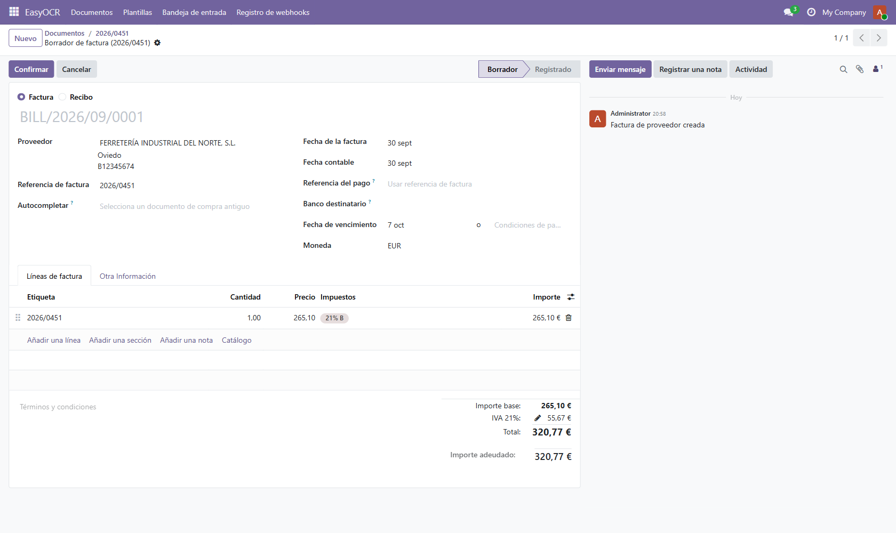

## Qué conviene revisar antes de confirmarla

- **El proveedor.** Si no existía, se ha creado al vuelo. Compruebe que no se ha
  duplicado con una ficha que ya tuviera.
- **El importe y el impuesto.** El módulo pone el importe en una sola línea, sin
  impuestos, y deja que Odoo aplique el impuesto por defecto de compras. En la
  imagen ha puesto el 21 %. Si la factura lleva otro tipo o varios, corríjalo
  aquí.
- **La fecha y la referencia.** Son las del documento original.

La factura queda **en borrador**: no se ha contabilizado nada. Puede editarla
con calma y confirmarla cuando esté conforme.

El mismo documento no se puede facturar dos veces: si ya tiene factura, el botón
desaparece de la ficha.

# 9. La bandeja de entrada

Otros módulos pueden entregarle archivos a EasyOCR sin que nadie los suba a
mano: un lector de documentos, una pasarela de correo, la captura del móvil. Lo
que llega por esa vía aparece en **EasyOCR > Bandeja de entrada**.

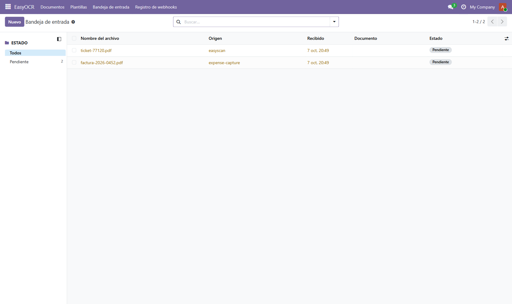

Cada línea dice **quién lo entregó** (la columna Origen), cuándo llegó y en qué
estado está.

Lo importante de la bandeja es lo que **no** hace: al recibir un archivo **no se
llama al servicio de lectura**. El archivo se queda ahí esperando a que alguien
decida leerlo. Así, recibir un archivo no cuesta nada.

Desde la bandeja puede procesar un archivo (lo convierte en documento y abre su
visor), descartarlo —sin borrar nada, se puede recuperar— o abrir el documento
que ya se creó a partir de él. Si el mismo archivo llega dos veces, se rechaza el
segundo: el módulo lo reconoce por su contenido, no por el nombre.

# 10. Capturar un ticket desde el móvil

Cualquiera con usuario en Odoo puede abrir la dirección `/easyocr/capture` en el
navegador del móvil y fotografiar un ticket. Está pensada para instalarse en la
pantalla de inicio del teléfono y usarse como una aplicación.

1. **Hacer una foto** abre la cámara. También puede **elegir una foto** que ya
   tenga en el teléfono.
2. La foto se encoge en el propio móvil antes de salir, para no gastar datos.
3. Al enviarla, queda en la bandeja de entrada, con origen `expense-capture`.

Si la lectura con IA está encendida, además se lee en el acto y la propia página
le enseña lo que se ha sacado del ticket. Si está apagada —como en la imagen—,
la foto se guarda igual y se lee a mano.

# 11. El registro de webhooks

Si el servicio de EasyOCR avisa a Odoo cuando termina una lectura, cada llamada
queda registrada en **EasyOCR > Registro de webhooks**.

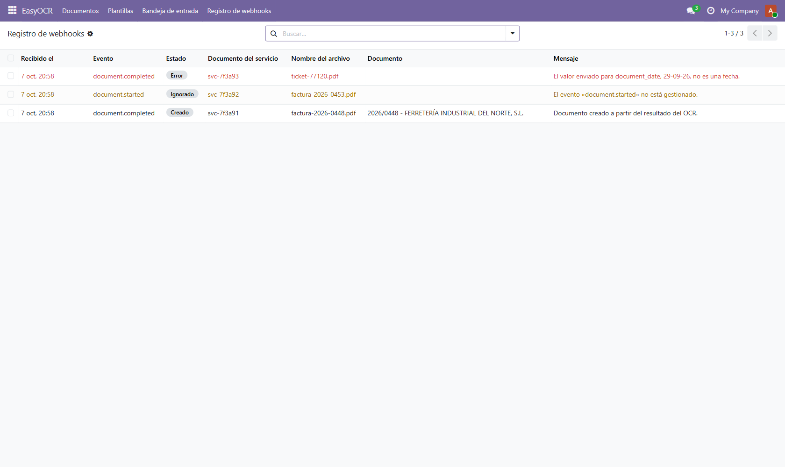

| **Recibido el** | Cuándo llegó la llamada. |
| **Evento** | Qué avisaba el servicio. |
| **Estado** | **Creado** si dio lugar a un documento, **Ignorado** si el aviso no era de los que se atienden, **Error** si el aviso llegó bien pero traía un valor ilegible. |
| **Documento del servicio** | El identificador que el servicio da al documento. |
| **Mensaje** | En palabras, qué pasó. |

Este registro es la única huella de las llamadas que no crearon nada, así que es
lo primero que hay que mirar si un documento leído por el servicio no aparece
por ninguna parte.

# 12. Preguntas frecuentes

## He instalado el módulo y no lee mis escaneos

Es lo esperado. Un escaneo es una imagen, y para leerlo hace falta el servicio de
EasyOCR configurado y la opción **Leer con IA** encendida. Un PDF que ya trae
texto, en cambio, se lee sin configurar nada.

## ¿Puedo usar el módulo sin contratar el servicio?

Sí, para PDF que ya llevan texto. El módulo se instala, se usa y se lee igual;
lo único que no hará es leer fotos ni escaneos.

## Los recuadros de la plantilla no aparecen solos en el siguiente documento

Correcto, y es una limitación conocida de esta versión: la plantilla se guarda
pero todavía no se aplica sola. Hay que volver a dibujar los recuadros en cada
documento.

## El botón «Leer con IA» no me aparece

Ese botón es de **responsable**. Pídale a quien administra su Odoo que le asigne
el permiso, o que lance él la lectura.

## ¿Qué pasa si la lectura se equivoca?

Nada irreversible. El módulo solo **propone**: rellena los campos de la ficha y
crea un borrador de factura. Nada se contabiliza hasta que usted confirma la
factura, así que siempre hay un momento para revisar y corregir.

## He creado una factura por error

La factura está en borrador. Bórrela como cualquier otra factura de proveedor en
borrador y vuelva a la ficha del documento: el módulo volverá a ofrecerle
**Crear factura**.

## ¿Se suben mis documentos a algún sitio?

Solo si usted lo pide. El módulo no manda nada al servicio hasta que se pulsa
**Leer con IA** —o hasta que llega una foto desde la captura del móvil con la
lectura encendida—. Recibir un archivo en la bandeja de entrada no envía nada.

---

*EasyOCR es una marca de EasySoft Tech S.L. Para soporte, escriba a
[info@easysoft.es](mailto:info@easysoft.es).*
