[[TOC]]

[[TOF]]

# 1. Qué hace EasyOCR y qué necesita

EasyOCR lee las facturas de proveedor y los tickets de gasto que llegan en PDF o
en foto, saca de ellos el proveedor, el número, la fecha y los importes, y con
esos datos prepara la factura de proveedor en Odoo.

Funciona con documentos de dos clases:

- **PDF que ya llevan texto** (los que le envía un proveedor por correo
  electrónico). Estos se leen siempre, sin coste y sin conexión a nada.
- **Escaneos y fotos** de papel, que son una imagen y no llevan texto dentro.
  Para leer estos hace falta el servicio de EasyOCR.

## Lo que necesita para funcionar

El módulo se instala y funciona solo. Puede usarlo para leer PDF con texto
desde el primer día, gratis y sin configurar nada.

Lo que **no** puede hacer por sí solo es leer un escaneo o una foto: eso lo
resuelve el servicio de extracción de EasyOCR, y **hasta que no lo configure,
los escaneos y las fotos no se leerán**. Si pulsa «Leer con IA» sin haberlo
configurado, el módulo se lo dirá con este aviso, sin más consecuencias:

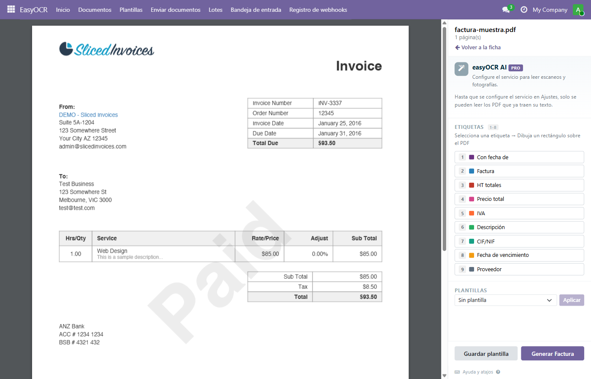

Cuando eso ocurre no se pierde nada: el documento se queda donde estaba, con el
archivo adjunto intacto, y puede leerlo a mano o volver a intentarlo más tarde.

## Lo que cuesta

El módulo es **software libre**, con la misma licencia que el propio Odoo. No
hay nada que pagar por él y el código fuente completo va con cada versión.

Lo que se contrata aparte es **el servicio de lectura**. Si trabaja solo con PDF
que ya traen texto, no necesita contratar nada.

# 2. Instalación

El módulo se llama **EasyOCR** y se instala como cualquier otra aplicación de
Odoo: entre en **Aplicaciones**, borre el filtro «Aplicaciones» y busque
«EasyOCR».

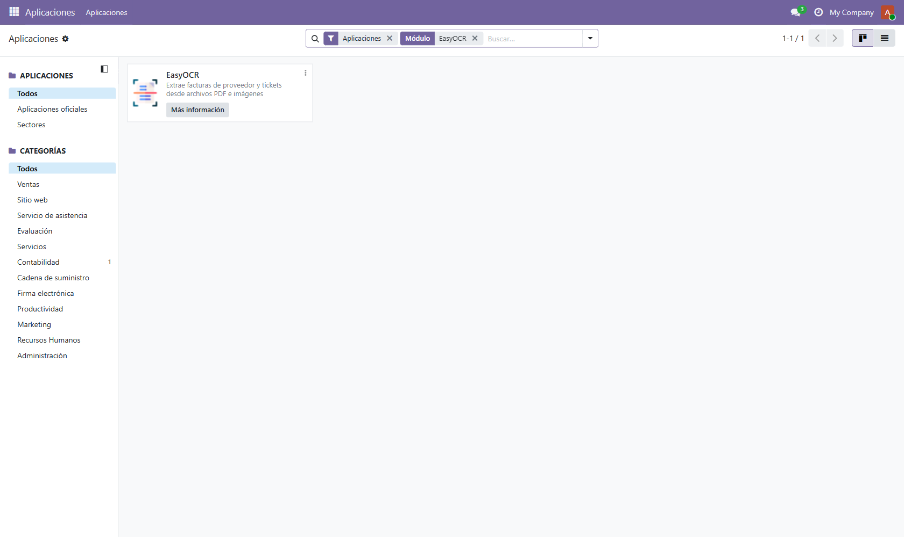

Sobre la ficha verá el botón para instalarla. Si ya está instalada, la ficha se
limita a ofrecerle más información, como en la imagen.

Al terminar la instalación aparece una aplicación nueva llamada **EasyOCR** en
el menú principal. Al abrirla entra en su pantalla de inicio:

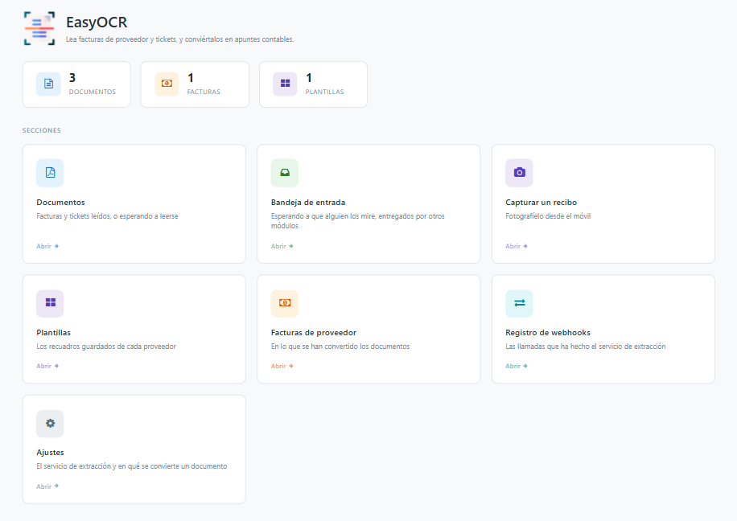

Arriba del todo están los números: cuántos **documentos** hay, cuántos han
acabado en **factura** y cuántas **plantillas** tiene guardadas. Cada uno es
también un atajo: púlselo y va a su lista.

Debajo, cada tarjeta lleva a un sitio:

- **Subir un documento** — abre la pantalla de trabajo, que espera el PDF o la foto.
  Es el camino corto para meter una factura a mano.
- **Documentos** — las facturas y tickets leídos, o esperando a leerse.
- **Bandeja de entrada** — lo que le han entregado otros módulos y todavía
  nadie ha mirado.
- **Capturar un recibo** — la página del móvil, para fotografiar un ticket.
- **Plantillas** — los recuadros guardados de cada proveedor.
- **Facturas de proveedor** — las facturas de compra, donde han ido a parar los
  documentos que ha facturado.
- **Registro de webhooks** — las llamadas que ha hecho el servicio.
- **Ajustes** — solo aparece si usted puede configurar el módulo.

El **Abrir** de cada tarjeta, con su flecha, indica que la tarjeta entera se
pulsa; no hay que apuntarle a nada en concreto.

Los permisos van en dos niveles: **Usuario** (trabajar con documentos) y
**Responsable** (además, configurar y lanzar la lectura con IA). Se asignan
desde **Ajustes > Usuarios**, como cualquier otro permiso de Odoo.

# 3. Configuración

La configuración vive en **Ajustes > EasyOCR** y viene en dos bloques.

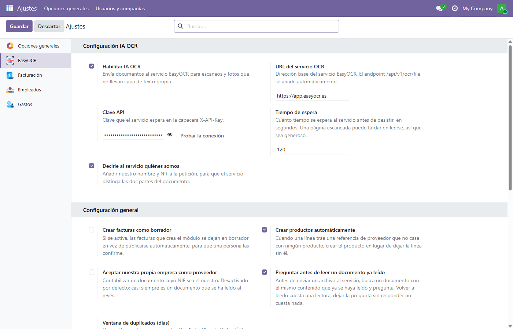

## Leer con IA

|[tabla: Opciones del servicio de lectura]|
|---|---|
| **Leer con IA** | Enciende o apaga el envío de documentos al servicio. Mientras está apagado, el módulo no manda nada a ningún sitio. |
| **URL del servicio** | La dirección del servicio de EasyOCR. Se escribe sin nada más: el módulo añade por su cuenta la parte final de la dirección. |
| **Clave API** | La clave que identifica su cuenta ante el servicio. Se la da EasyOCR al contratar el servicio. |
| **Probar la conexión** | Comprueba la clave contra el servicio y dice si vale. Está justo debajo de la clave y **no gasta ninguna lectura**. |
| **Tiempo de espera** | Cuántos segundos espera Odoo la respuesta antes de darse por vencido. Una página escaneada puede tardar, así que conviene dejarlo generoso. |
| **Decirle al servicio quiénes somos** | Añade el nombre y el NIF de su empresa a la petición, para que el servicio distinga las dos partes del documento y no le devuelva su propia empresa como proveedor. |

### Probar la conexión

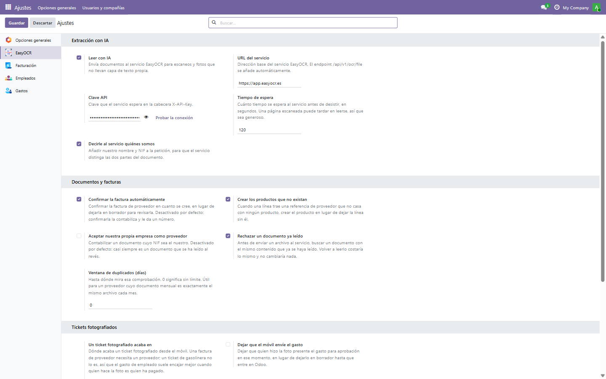

Antes de leer el primer documento, pulse **Probar la conexión**. Pregunta al
servicio a nombre de quién va esa clave, y contesta una de estas cosas:

|[tabla: Qué contesta la comprobación de la conexión]|
|---|---|
| **La cuenta y el plan** | La clave vale. Además dice cuántas páginas le quedan este mes. |
| **El servicio ha rechazado la clave API** | La clave no es válida, o es de otra cuenta. Cópiela otra vez desde el panel de EasyOCR. |
| **El servicio no se ha podido alcanzar** | La dirección del servicio no es correcta o no hay conexión. |
| **El servicio necesita una clave API** | No hay ninguna escrita en la casilla. |

Esta comprobación **no consume ninguna lectura**: solo pregunta quién es, no
manda ningún documento. Por eso se puede pulsar tantas veces como haga falta.

## Documentos y facturas

|[tabla: Qué hace el módulo con lo que lee]|
|---|---|
| **Confirmar la factura automáticamente** | Confirma la factura en cuanto se crea, en lugar de dejarla en borrador. Apagado viene: confirmar contabiliza la factura y le pone número. Si al confirmar falla algo, la factura se queda en borrador con el motivo escrito en ella. |
| **Crear los productos que no existan** | Cuando una línea trae una referencia de proveedor que no casa con ningún producto, lo crea. Apagado viene, para que el catálogo no crezca solo. |
| **Aceptar nuestra propia empresa como proveedor** | Permite contabilizar un documento cuyo NIF sea el suyo. Apagado viene, porque casi siempre es un documento que se ha leído al revés. |
| **Rechazar un documento ya leído** | Antes de enviar un archivo al servicio, busca otro documento con el mismo contenido que ya se haya leído y no lo manda. Encendido viene: leerlo otra vez costaría lo mismo y no cambiaría nada. |
| **Ventana de duplicados** | Hasta dónde mira esa comprobación, en días. 0 significa sin límite. Sirve para un proveedor cuyo documento mensual es exactamente el mismo archivo cada mes. |

## Tickets fotografiados

|[tabla: Dónde acaba un ticket fotografiado desde el móvil]|
|---|---|
| **Un ticket fotografiado acaba en** | **Factura de proveedor** (viene así) o **gasto de empleado**. Una factura de proveedor necesita un proveedor; un ticket de gasolinera no lo es, así que el gasto de empleado suele encajar mejor cuando quien hace la foto es quien ha pagado. |
| **Dejar que el móvil envíe el gasto** | Permite que quien hizo la foto presente el gasto para aprobación en ese momento, en lugar de dejarlo en borrador hasta que entre en Odoo. Aprobar sigue siendo cosa de quien aprueba: nadie aprueba su propio gasto. |

Para el gasto de empleado hace falta que quien fotografía tenga **ficha de
empleado** en Odoo. Si no la tiene, el ticket se guarda igual y la página del
móvil se lo dirá, en lugar de perderse.

## Webhooks

Estos tres solo importan si va a recibir documentos por la vía automática, sin
nadie delante. De serie, un aviso del servicio **solo deja el documento**: no
factura nada.

|[tabla: Qué puede hacer un aviso del servicio por su cuenta]|
|---|---|
| **Crear la factura desde un webhook** | Cuando el servicio avisa de que ha terminado de leer, crear la factura sin esperar a nadie. Apagado viene: un webhook es un mensaje de fuera y una factura es un apunte contable. |
| **Marcar la factura como pagada** | Registrar el pago en esas facturas, como si el dinero ya hubiera salido. Solo se aplica a una factura confirmada: una en borrador no tiene contra qué pagarse, y el registro lo dirá. |
| **Cuenta bancaria** | Dónde se registra ese pago. |
| **Forma de pago** | Cómo se registra en esa cuenta. Si se deja vacío, Odoo coge el que la cuenta tenga por defecto. |

Cuando termine, pulse **Guardar**. El botón **Descartar** deja todo como estaba.

**Nada de esto hace falta si solo va a leer PDF que ya traen texto.** Deje
«Leer con IA» apagado y el módulo funcionará igual.

## Un ajuste que no está en esta pantalla

Si va a recibir documentos desde el servicio por la vía automática —sin nadie
delante— hay un quinto ajuste que no tiene casilla en la pantalla: el **secreto
compartido**. Se guarda como parámetro del sistema, con el nombre
`easyocr.webhook_secret`.

Mientras ese valor no exista, la dirección que recibe los avisos del servicio
rechaza **todas** las llamadas. Es deliberado: un secreto con un valor por
defecto no es un secreto, así que el módulo prefiere quedarse cerrado antes que
abierto. Si no va a usar esta vía, no tiene que hacer nada.

# 4. Dónde viven los documentos

## Meter un documento: un paso

Desde la pantalla de inicio, **Subir un documento** es el camino corto: lleva a
la pantalla de trabajo con el documento todavía sin elegir.

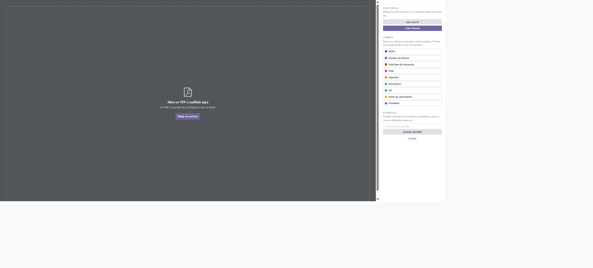

Ahí tiene dos maneras de meter el archivo, y dan lo mismo:

- Pulsar **Elegir un archivo** y buscarlo.
- **Arrastrarlo** desde el escritorio y soltarlo encima.

En cuanto suelta el archivo, la misma pantalla se convierte en el visor, con el
documento dentro. No hay que crear una ficha, ni adjuntar nada, ni guardar
antes, y el documento se llama como el archivo.

Esto **no llama al servicio**: abrir un archivo no es pedir que se lea.

## La lista de documentos

Lo mismo se puede hacer desde **EasyOCR > Documentos**, que es donde están
todos los documentos y donde se vuelve a ellos después.

La lista tiene una columna **Estado** con tres valores posibles:

- **Pendiente** (en negro): el archivo está dentro, todavía no se ha leído.
- **Procesado** (en verde): ya se ha leído y revisado.
- **Error** (en rojo): se intentó leer y no se pudo. El motivo está en el propio
  documento, y se puede volver a intentar.

Puede buscar por referencia, proveedor o número de documento, y agrupar por
proveedor, estado o fecha desde los filtros de la barra de búsqueda.

Al abrir un documento, la ficha tiene los datos a la izquierda y los botones
arriba:

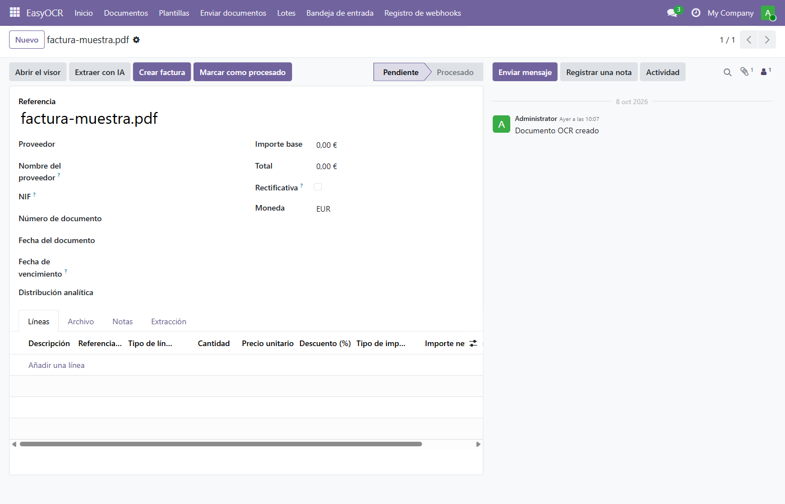

|[tabla: Los botones de la ficha de un documento]|
|---|---|
| **Abrir el visor** | Abre la pantalla grande donde se ve el documento y se dibujan las casillas. |
| **Leer con IA** | Manda el archivo al servicio. Solo aparece si hay archivo adjunto y si tiene usted el permiso de responsable. |
| **Crear factura** | Prepara la factura de proveedor con lo que hay en la ficha. |
| **Marcar como procesado** | Da el documento por revisado sin crear nada. |

Debajo, cuatro pestañas: **Líneas**, **Archivo** (el PDF), **Notas** y
**Extracción** (la respuesta del servicio y su nivel de confianza, útil solo
cuando hay que pedir soporte).

## Las líneas que se han leído

La pestaña **Líneas** es lo que el servicio ha sacado del documento, artículo a
artículo, y es de donde sale la factura:

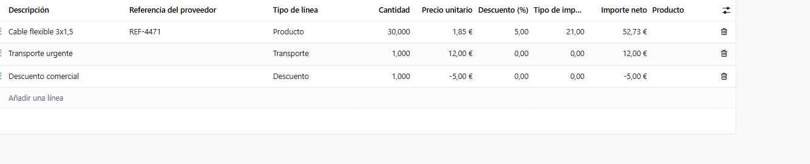

Cada línea trae su descripción, la referencia que el documento imprime, la
cantidad, el precio, el descuento y el tipo de IVA. **Se puede corregir
cualquier cosa aquí**: leer un documento mal es lo normal, y arreglarlo en esta
pestaña es más barato que arreglarlo luego en la factura. El **Importe neto** se
recalcula solo al cambiar la cantidad, el precio o el descuento.

Para quitar una línea que no debería estar, la papelera de su derecha. Para
añadir una que el servicio no vio, **Añadir una línea**.

Si el documento se lee otra vez, estas líneas se reemplazan por las de la nueva
lectura, no se suman.

# 5. El visor: dibujar de dónde se lee cada dato

El visor es la pantalla que da sentido al módulo. Se abre con **Abrir el visor**
y ocupa toda la pantalla: el documento a la izquierda y, en una columna a la
derecha, todo lo que se puede hacer con él.

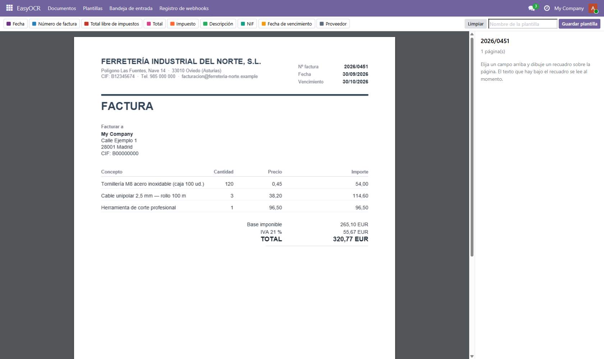

La columna tiene cuatro apartados, de arriba abajo:

| **Leer con IA** | El botón que manda el documento al servicio, y el de crear la factura. |
| **Campos** | Los nueve datos que se pueden leer, uno por botón. El color de cada botón es el color con el que se pintará su recuadro, así que siempre se sabe qué recuadro es qué. |
| **Plantilla** | Ponerle nombre a los recuadros y guardarlos. |
| **Lo que ha leído** | Los valores que van saliendo de cada recuadro. Aparece en cuanto hay uno. |

## El paso a paso

1. Pulse el botón del dato que quiere leer. Por ejemplo, **Proveedor**.
2. Con el botón pulsado, arrastre el ratón sobre el documento para dibujar un
   recuadro alrededor de ese dato. Como el recuadro se lee del texto que hay
   debajo, puede ajustarlo a una parte de la línea si le conviene.
3. Al soltar, el texto que ha quedado dentro aparece abajo, en **Lo que ha
   leído**.

Repita con los datos que le interesen. Así queda un documento con cuatro campos
marcados:

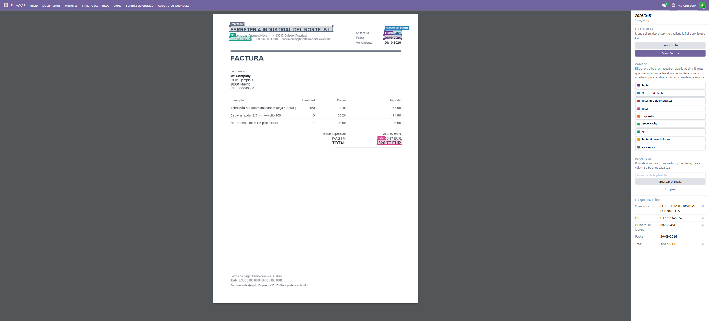

Si un recuadro no le convence, la **×** de su derecha lo quita. El botón
**Limpiar** borra todos de golpe.

Arriba del todo de la columna están los dos botones que cierran el trabajo, para
que no haya que salir del visor:

|[tabla: Los dos botones del visor]|
|---|---|
| **Leer con IA** | Manda el documento al servicio y rellena la ficha con lo que lea. Es lo mismo que el botón de la ficha del documento. |
| **Crear factura** | Prepara la factura de proveedor con lo que hay en la ficha y la abre. |

Mientras el servicio está leyendo, la columna lo dice y los botones quedan
bloqueados: una página escaneada tarda unos segundos, y es mejor saber que está
trabajando que pulsar dos veces.

Si la cuenta no puede leer —cuota agotada, suscripción vencida—, el módulo lo
avisa aquí arriba en cuanto se abre el visor, antes de que nadie lo intente.

Con esto ya tiene lo importante: los datos del proveedor leídos del documento,
sin teclear.

# 6. Guardar la plantilla del proveedor

Cuando los recuadros son los que quiere, póngale un nombre en la casilla
**Nombre de la plantilla** y pulse **Guardar plantilla**.

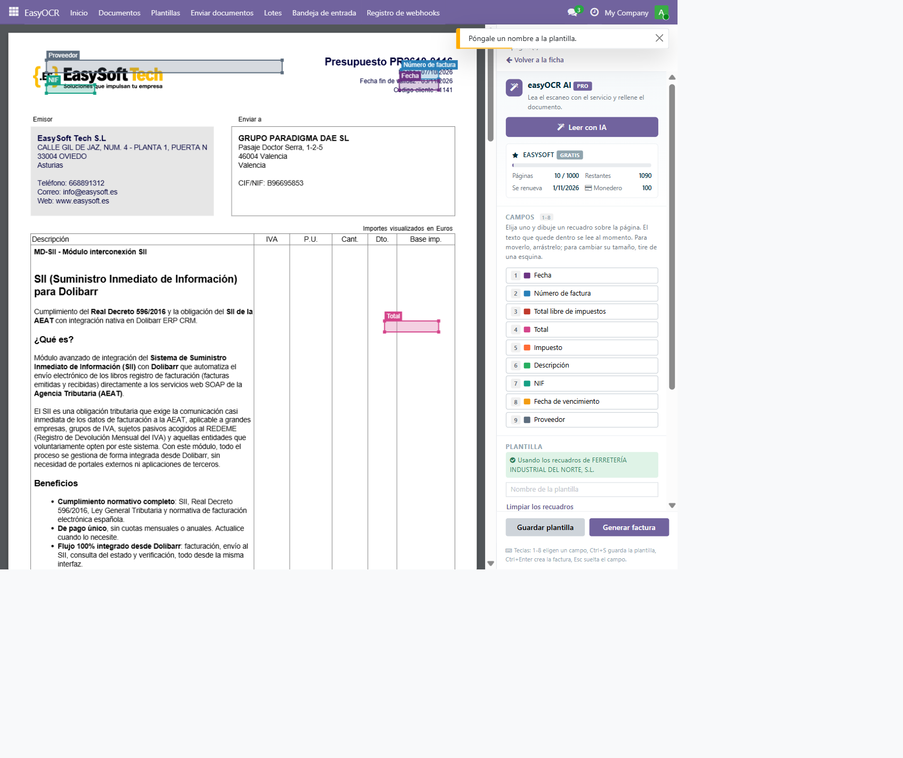

La plantilla queda guardada **a nombre de ese proveedor**, en **EasyOCR >
Plantillas**, con las casillas y las coordenadas exactas de cada una:

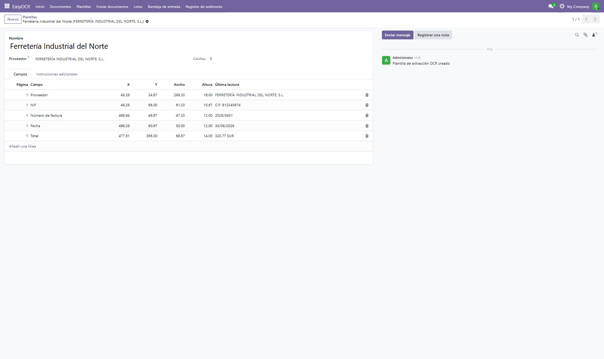

El proveedor lo resuelve el módulo solo, por el NIF del documento y, si no lo
hay, por su nombre. Si el documento todavía no está identificado —nadie ha
leído aún de quién es—, la plantilla se guarda igual, pero sin proveedor.

## La próxima vez, los recuadros ya están puestos

Abra otro documento del mismo proveedor y los recuadros aparecerán ya
dibujados, con el aviso de a quién pertenecen:

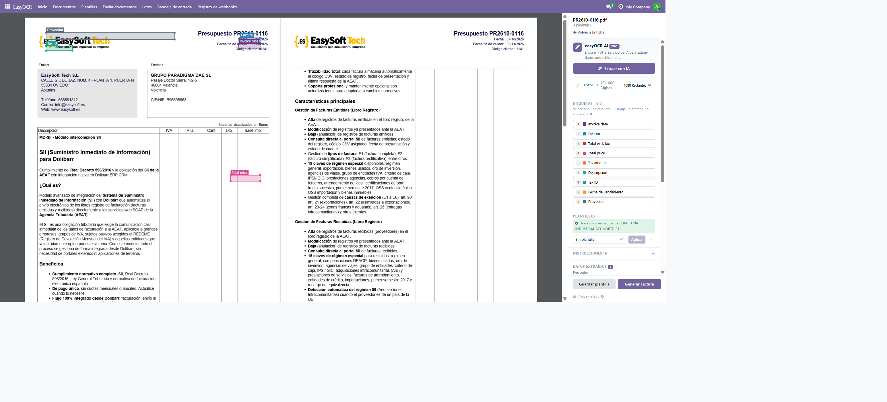

Lo que se guarda es **dónde** están los recuadros. El texto se lee otra vez del
documento que tiene delante, así que **Lo que ha leído** muestra siempre el de la
factura que está abierta. Si algún recuadro no encaja, la **×** lo quita y lo
dibuja de nuevo.

Dos detalles que conviene conocer:

- Si el documento no tiene proveedor identificado todavía, no hay plantilla que
  buscar. Léalo antes con **Leer con IA**: es la lectura la que pone el NIF y el
  nombre, y en cuanto lo hace, los recuadros aparecen solos.
- Si un proveedor tiene varias plantillas, se aplica **la última que se guardó**.

# 7. Leer un documento con IA

El botón **Leer con IA** es lo que lee los escaneos y las fotos. Manda el
archivo al servicio y rellena la ficha con lo que devuelve: nombre y NIF del
proveedor, número de documento, fecha, importe base y total.

Si sale bien, verá un aviso de que el documento se ha leído y los campos
rellenos. Si sale mal, el documento **no se pierde**: se queda con el motivo
escrito, y puede corregirlo a mano o volver a intentarlo.

## Cuando falla

Los avisos que se ve son estos:

|[tabla: Motivos por los que una lectura puede fallar]|
|---|---|
| **La extracción con IA está desactivada** | No está encendida la opción en Ajustes. Actívela y vuelva a intentarlo. |
| **El servicio no se ha podido alcanzar** | La dirección no es correcta o no hay conexión. Revise la URL del servicio. |
| **El servicio ha rechazado la clave API** | La clave no es válida o es de otra cuenta. |
| **El servicio está caído u ocupado** | Es temporal. Vuelva a intentarlo dentro de un rato. |
| **No se ha podido emparejar ningún proveedor** | La lectura fue bien, pero el NIF del documento no está en ningún contacto. Cree el proveedor o indíquelo a mano en la ficha. |

Un aviso que **no** es un error: cuando el servicio solo puede leer el documento
en parte, lo dice y añade si merece la pena volver a intentarlo. En ese caso los
datos que sí ha leído quedan puestos, y el resto se completa a mano.

# 8. Crear la factura de proveedor

Con la ficha rellena —por la lectura con IA o a mano— el paso final es **Crear
factura**.

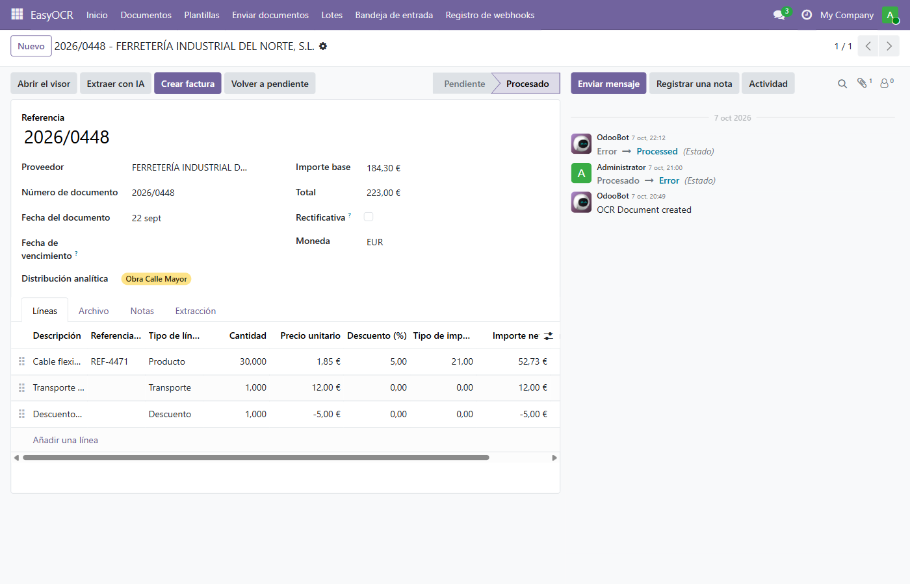

El módulo busca el proveedor por su NIF y, si no lo encuentra, por el nombre.
Después prepara un borrador de factura de proveedor con esos datos:

## Cómo se arma la factura

- **Una línea de factura por cada línea leída** en la pestaña **Líneas**, con su
  cantidad, su precio y su descuento. Un documento con cinco artículos da una
  factura con cinco líneas, no una sola con el total.
- **El producto** de cada línea se busca por la referencia que imprime el
  documento: primero entre las referencias de ese proveedor, después por nuestro
  código o código de barras. Si no aparece y tiene encendido *Crear los
  productos que no existan*, se crea.
- **El IVA** de cada línea sale del tipo leído en el documento, buscando el
  impuesto de compras de ese mismo tipo. Si su empresa no tiene ninguno
  configurado a ese tipo, la línea se queda sin impuesto: el módulo no se lo
  inventa.

Si el documento no trae líneas —porque llegó por la vía automática o porque se
rellenó a mano—, la factura se hace con una sola línea por el importe base, sin
impuestos, como se ha hecho siempre.

## Qué conviene revisar antes de confirmarla

- **El proveedor.** Si no existía, se ha creado al vuelo. Compruebe que no se ha
  duplicado con una ficha que ya tuviera.
- **Las líneas y sus impuestos.** Sobre todo si el documento lleva varios tipos
  de IVA o descuentos por línea.
- **La fecha y la referencia.** Son las del documento original.

La factura queda **en borrador**: no se ha contabilizado nada. Puede editarla
con calma y confirmarla cuando esté conforme.

El mismo documento no se puede facturar dos veces: si ya tiene factura, el botón
desaparece de la ficha.

# 9. La bandeja de entrada

Otros módulos pueden entregarle archivos a EasyOCR sin que nadie los suba a
mano: un lector de documentos, una pasarela de correo, la captura del móvil. Lo
que llega por esa vía aparece en **EasyOCR > Bandeja de entrada**.

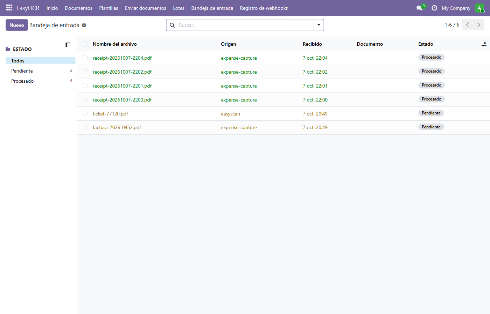

Cada línea dice **quién lo entregó** (la columna Origen), cuándo llegó y en qué
estado está.

Lo importante de la bandeja es lo que **no** hace: al recibir un archivo **no se
llama al servicio de lectura**. El archivo se queda ahí esperando a que alguien
decida leerlo. Así, recibir un archivo no cuesta nada.

Desde la bandeja puede procesar un archivo (lo convierte en documento y abre su
visor), descartarlo —sin borrar nada, se puede recuperar— o abrir el documento
que ya se creó a partir de él. Si el mismo archivo llega dos veces, se rechaza el
segundo: el módulo lo reconoce por su contenido, no por el nombre.

# 10. Capturar un ticket desde el móvil

Cualquiera con usuario en Odoo puede abrir la dirección `/easyocr/capture` en el
navegador del móvil y fotografiar un ticket. Está pensada para instalarse en la
pantalla de inicio del teléfono y usarse como una aplicación.

1. **Hacer una foto** abre la cámara. También puede **elegir una foto** que ya
   tenga en el teléfono.
2. La foto se encoge en el propio móvil antes de salir, para no gastar datos.
3. Al enviarla, queda en la bandeja de entrada, con origen `expense-capture`.

Si la lectura con IA está encendida, además se lee en el acto y la propia página
le enseña lo que se ha sacado del ticket. Si está apagada —como en la imagen—,
la foto se guarda igual y se lee a mano.

Si en **Ajustes > EasyOCR** ha puesto que un ticket fotografiado acabe en un
**gasto de empleado**, la página lo dirá y el gasto quedará creado a nombre de
quien hizo la foto, con la foto adjunta. Nada más: si quiere que además se
presente para aprobación sin abrir Odoo, encienda la casilla de al lado.

# 11. El registro de webhooks

Si el servicio de EasyOCR avisa a Odoo cuando termina una lectura, cada llamada
queda registrada en **EasyOCR > Registro de webhooks**.

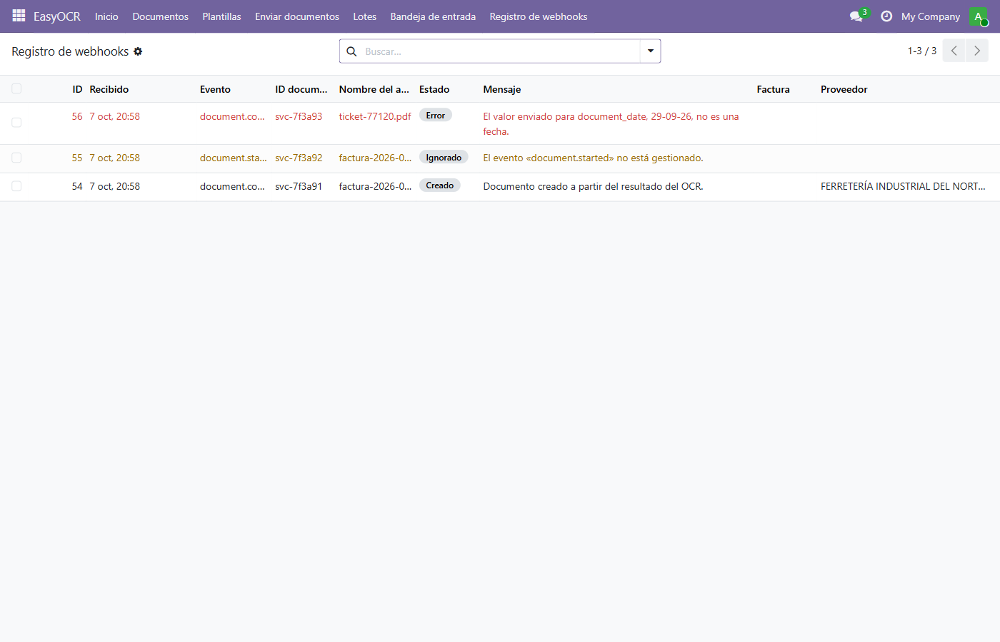

|[tabla: Lo que guarda cada línea del registro de webhooks]|
|---|---|
| **Recibido el** | Cuándo llegó la llamada. |
| **Evento** | Qué avisaba el servicio. |
| **Estado** | **Creado** si dio lugar a un documento, **Ignorado** si el aviso no era de los que se atienden, **Error** si el aviso llegó bien pero traía un valor ilegible. |
| **Documento del servicio** | El identificador que el servicio da al documento. |
| **Mensaje** | En palabras, qué pasó. |

Este registro es la única huella de las llamadas que no crearon nada, así que es
lo primero que hay que mirar si un documento leído por el servicio no aparece
por ninguna parte.

La columna **Mensaje** cuenta además lo que hizo el aviso cuando se le ha dado
permiso para ir más allá de dejar el documento: si creó la factura, si registró
el pago y, cuando no pudo, por qué. Por ejemplo, si pidió el pago pero la
factura se quedó en borrador, aquí lo dirá en lugar de quedarse callado.

# 12. Enviar varios documentos de una vez

Cuando llega la carpeta entera del trimestre, mandar los archivos de uno en uno
es la parte pesada. **EasyOCR > Enviar documentos** manda un montón de golpe y
los deja leídos y repartidos, uno por documento.

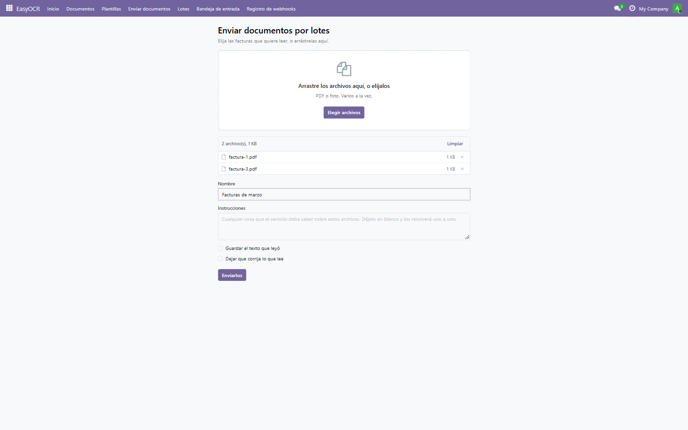

Elija los archivos —**Elegir archivos**, o arrastrarlos encima— y póngales un
nombre que después le sirva para encontrarlos. Los archivos se quedan en la
pantalla, sin enviarse, hasta que pulse **Enviarlos**: ahí es donde se paga la
lectura, y por eso nada sale antes.

Dos casillas, las dos apagadas de fábrica:

|[tabla: Lo que se le puede pedir a un lote]|
|---|---|
| **Guardar el texto que leyó** | Le pide al servicio, además, el texto tal cual de cada página. No hace falta para crear la factura y el módulo no lo guarda. |
| **Dejar que corrija lo que lee** | Deja que el servicio arregle lo que acierta a leer y marque lo que ha cambiado, en vez de devolver el documento tal cual está. |

El campo **Instrucciones** es para lo que valga para todos los archivos del lote
a la vez. Lo que no se ponga ahí, el servicio lo saca de cada documento.

## Mientras se leen

Al pulsar **Enviarlos**, el servicio se lleva todos los archivos en una sola
llamada y contesta en seguida. La pantalla se queda con el lote y va diciendo por
dónde va, sin que haya que recargar nada.

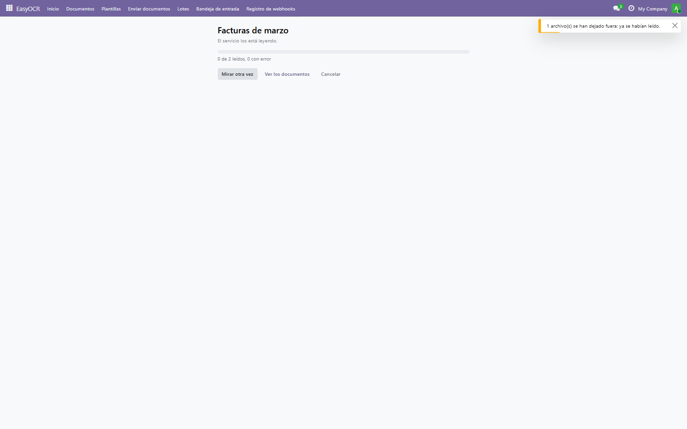

Una vez terminado dice cuántos se han leído y cuántos no:

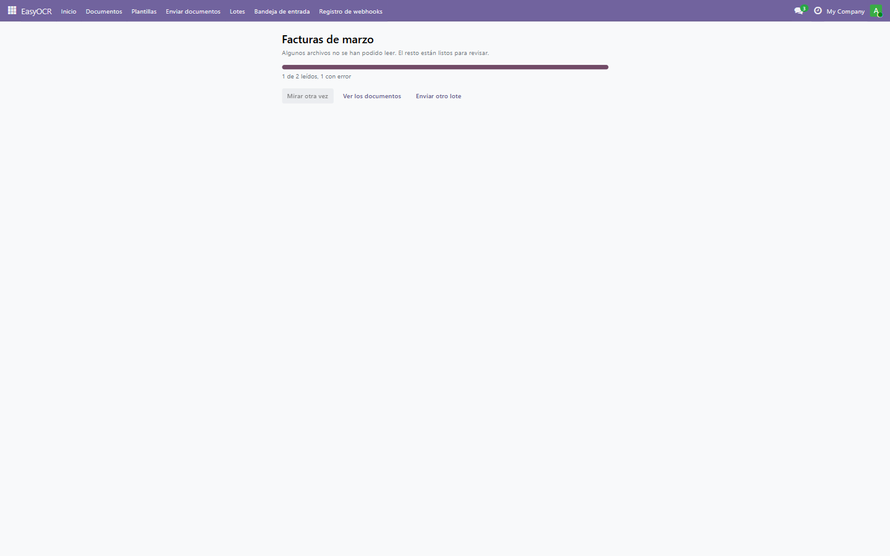

- **Mirar otra vez** vuelve a preguntar al servicio. Si nadie mira, el módulo lo
  pregunta solo cada diez minutos y recoge lo que haya.
- **Ver los documentos** abre la lista de los documentos de ese lote, que es
  donde se revisa y se corrige cada uno antes de que sea una factura.
- **Enviar otro lote** deja la pantalla lista para el siguiente montón.

Un archivo que el servicio no ha podido leer no se pierde: queda como documento
con el motivo escrito, y se puede volver a mandar.

## Si un archivo ya se había leído

Un lote es donde el dinero se va más rápido, así que el módulo mira cada archivo
antes de enviarlo. Si alguno de los elegidos ya se había leído, no lo envía y
pregunta:

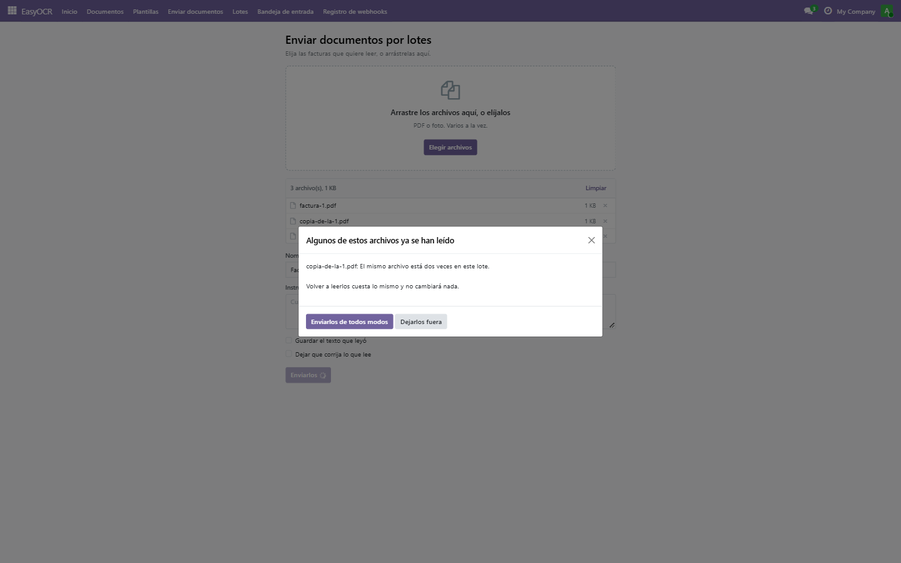

Las dos respuestas hacen lo que dicen:

- **Enviarlos de todos modos** los manda igual. Es lo que quiere quien ha
  corregido un archivo y lo vuelve a pasar.
- **Dejarlos fuera** los saca del lote y manda el resto. Los archivos que se
  quedan fuera no se han leído y no se han pagado: siguen en **Documentos** como
  pendientes, por si los quiere mandar otro día.

Esta comprobación es la misma que protege al documento suelto, y respeta el
**Margen de duplicados** de los ajustes: una factura que se repite todos los
meses se puede volver a leer cuando pasa el tiempo que haya configurado.

# 13. Preguntas frecuentes

## He instalado el módulo y no lee mis escaneos

Es lo esperado. Un escaneo es una imagen, y para leerlo hace falta el servicio de
EasyOCR configurado y la opción **Leer con IA** encendida. Un PDF que ya trae
texto, en cambio, se lee sin configurar nada.

## ¿Puedo usar el módulo sin contratar el servicio?

Sí, para PDF que ya llevan texto. El módulo se instala, se usa y se lee igual;
lo único que no hará es leer fotos ni escaneos.

## He guardado la plantilla y no se aplica en el siguiente documento

Mire primero si el documento sabe de qué proveedor es. La plantilla se busca por
proveedor, y un documento recién metido todavía no tiene ninguno: se lo pone la
lectura. Léalo con **Leer con IA** y los recuadros aparecerán en cuanto el
servicio diga el NIF o el nombre.

Si el documento sí es de ese proveedor y aun así no aparecen, compruebe en
**EasyOCR > Plantillas** que la plantilla tiene casillas y que el proveedor de su
ficha es el mismo. Y si ese proveedor tiene varias plantillas, la que se aplica
es la última que se guardó.

## El botón «Leer con IA» no me aparece

Ese botón es de **responsable**. Pídale a quien administra su Odoo que le asigne
el permiso, o que lance él la lectura. En el visor aparece junto a **Crear
factura**, arriba del todo de la columna de la derecha.

## He puesto la clave API y sigue sin leer

Vaya a **Ajustes > EasyOCR** y pulse **Probar la conexión**, justo debajo de la
clave. Le dirá si el servicio acepta esa clave, con qué cuenta y cuántas páginas
le quedan este mes, y **no gasta ninguna lectura**. Si contesta que la ha
rechazado, la clave no es válida o es de otra cuenta: cópiela otra vez desde el
panel de EasyOCR sin espacios delante ni detrás.

## ¿Qué pasa si la lectura se equivoca?

Nada irreversible. El módulo solo **propone**: rellena los campos de la ficha y
crea un borrador de factura. Nada se contabiliza hasta que usted confirma la
factura, así que siempre hay un momento para revisar y corregir.

## He creado una factura por error

La factura está en borrador. Bórrela como cualquier otra factura de proveedor en
borrador y vuelva a la ficha del documento: el módulo volverá a ofrecerle
**Crear factura**.

## ¿Se suben mis documentos a algún sitio?

Solo si usted lo pide. El módulo no manda nada al servicio hasta que se pulsa
**Leer con IA** —o hasta que llega una foto desde la captura del móvil con la
lectura encendida—. Recibir un archivo en la bandeja de entrada no envía nada, y
elegir archivos para un lote tampoco: de un lote solo sale lo que se manda al
pulsar **Enviarlos**.

## He mandado un lote y se queda en «Leyéndose»

Es lo normal mientras el servicio trabaja: van uno detrás de otro, y un montón
grande tarda. La pantalla se actualiza sola cada pocos segundos y, si la deja, el
módulo vuelve a preguntar cada diez minutos hasta que termine. Cuando acabe, los
documentos aparecen leídos en **EasyOCR > Documentos**.

Si lleva así mucho tiempo, abra **EasyOCR > Lotes**, entre en el lote y pulse
**Mirar otra vez**: le dirá lo que conteste el servicio.

## ¿Cuántos archivos caben en un lote?

Lo decide su plan de EasyOCR, y el módulo lo sabe antes de enviar. Si elige más
de los que permite, lo dice al pulsar **Enviarlos** —sin enviar nada— y le dice
cuántos caben.

---

*EasyOCR es una marca de EasySoft Tech S.L. Para soporte, escriba a
[info@easysoft.es](mailto:info@easysoft.es).*
